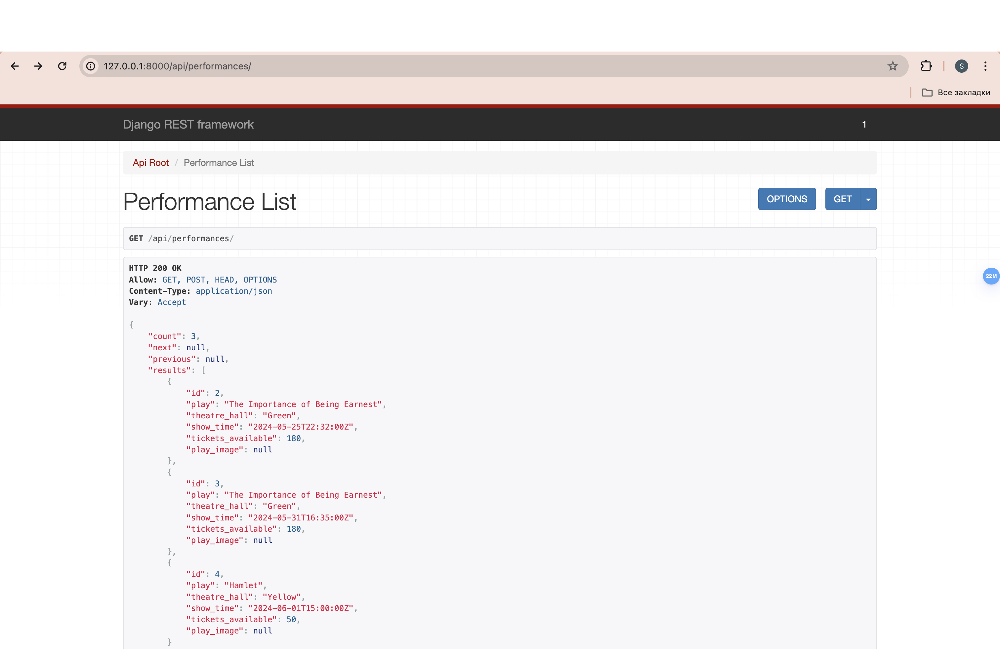
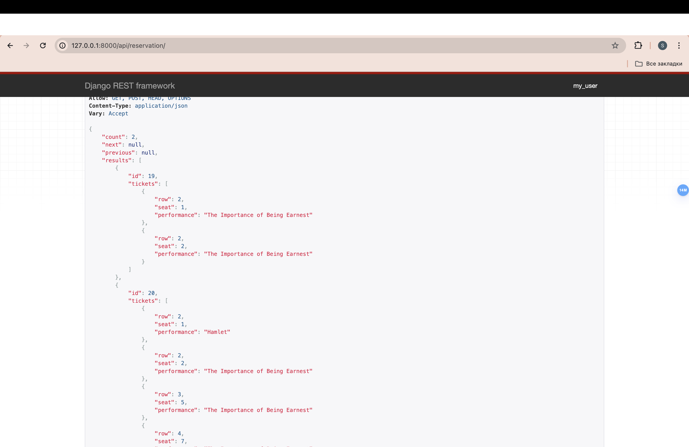
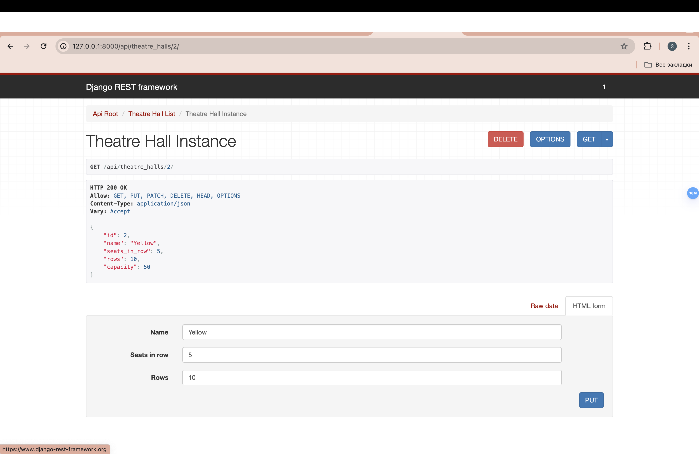
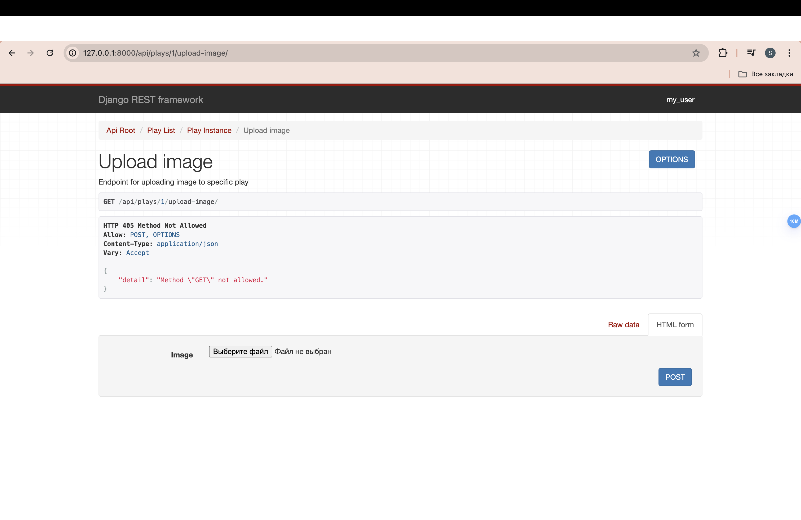
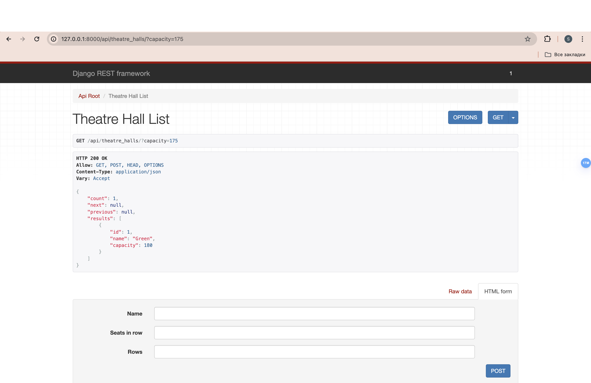

## Theatre-API
API for theatre which can manage all related tasks as a superuser and make online reservations as a user.
Consists of two applications, 
* theatre, which is the main with permissions, settings and authentication endpoints
and serves as a starting point.
* theatre_service, where the db, admin panel and main endpoints for manipulating data, validation are implemented.
* Endpoint are implemented mostly as CBVs.

### Credentials

    python manage.py createsuperuser

### For docker
    docker exec -it <container name/id> sh
    python manage.py createsuperuser

##  Installing / Getting Started
Application in divided in two separate applications with validators&serializers in schemas.py
models in models.py and global database settings in database.py and settings.py .

## Installing / Getting Started
### Using Shell Console
    git clone ...
    cd task-manager
    python3 -m venv venv
    source venv/bin/activate
    pip install -r requirements.txt
    python manage.py migrate
    python manage.py runserver

### Using Docker
    cp env.sample .env
    docker-compose build
    docker-compose up
Installs requirements and runs the Django server.

### Features
* JWT authentication
* Admin panel
* Managing tasks through the website interface
* Limited access for non-staff users
* Creating tickets to performances
* Uploading images for different plays

## Technical
* Dockerised application, you can simply run in on your server
* Convenient interface to add lots of tickets related to one order
* Endpoint are covered with UnitTests
* Login/Logout endpoints
* Throttling
* Authentication: JWT-based authentication for secure access.
* Admin Panel: Comprehensive admin panel for managing theatre operations.
* Task Management: Interface for managing tasks related to theatre operations.
* User Access Control: Limited access features for non-staff users.
* Ticketing: Create and manage tickets for performances.
* Media Management: Upload and manage images for different plays.

## Screenshots:

